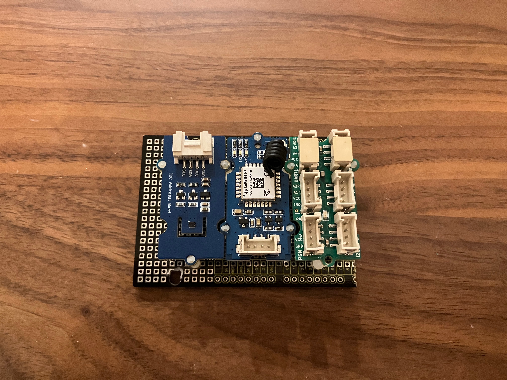
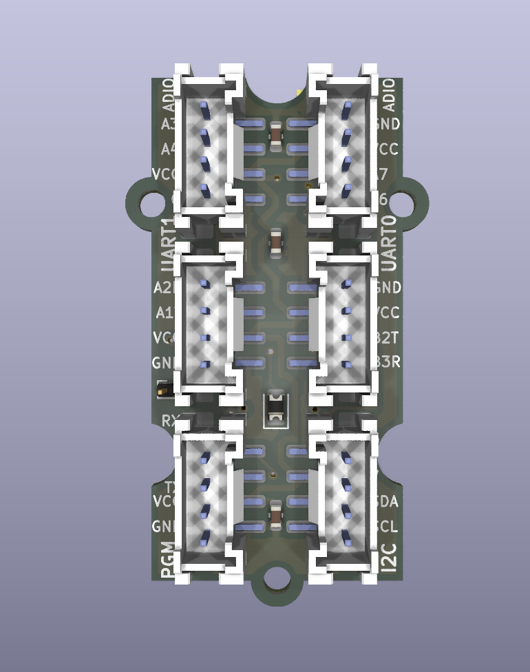

# GBT1
Seeed Studio Grove Base ATtiny3224

This module is based on the ATtiny tinyAVR 2-series 3224 MCU. It may only be 8-bit, but It is a powerful MCU that has an advanced differential ADC, programmable asynchronous logic, and can be run at very low power. It has one hardware I2C port, two (!) hardware UARTS, and five additional GPIOs that support ADC and PWM. The GPIOs allow for two additional general purpose Grove system ADIO connectors.

The Grove ATtiny3224 Base has 6 grove connector ports, and one Lipo battery port.
* PGM – A port that supports ATtiny UDPI programming
* I2C – A hardware I2C port
* UART0 – Hardware Serial port 0
* UART1 – Hardware Serial port 1
* ADIO0 – 2 GPIOs with ADC and PWM
* ADIO1 – 2 GPIOs with ADC and PWM
* Lipo battery connector – supports 2.7v – 5v, so a nominal 4.2v lithium battery is perfect – no regulator needed. It would be a good idea to use a battery with an integrated low-voltage cutoff circuit.
